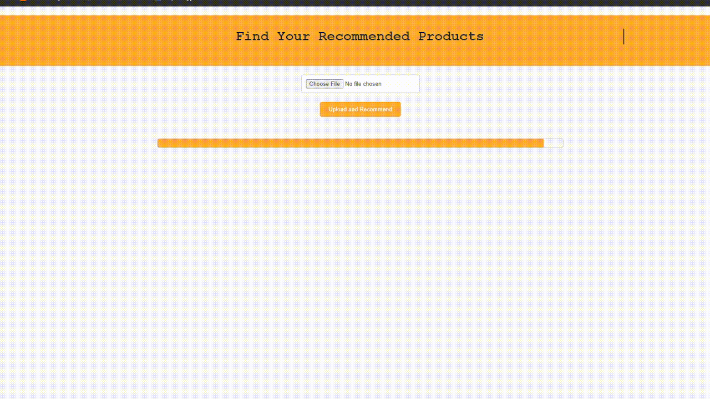

# KN Based Product Recommendation System

## Overview
This project implements a perfume recommendation system based on image classification using a K-Nearest Neighbors (KNN) model trained on a dataset of perfume images. Users can upload an image of a personal care/ clothing item, and the system suggests similar products from the dataset.

## Problem Statement
Shopping for products online can be overwhelming due to the vast variety available. Users often find it challenging to identify similar products to their preferred choices. This project aims to simplify the process by leveraging machine learning to recommend similar products based on uploaded images.

## Solution
The solution employs a KNN algorithm trained on features extracted from perfume images using Histogram of Oriented Gradients (HOG). The user uploads an image, which is preprocessed to extract features. The KNN model then finds the nearest neighbors in the feature space, recommending similar products.

## Features
- **Image Feature Extraction:** Utilizes HOG for extracting features from uploaded perfume images.
- **KNN Model:** Implements a KNN model to find similar perfumes based on extracted features.
- **Web Interface:** Provides a web-based interface for users to upload perfume images and receive recommendations.

## Usage
To run the application locally, follow these steps:
1. Clone the repository: `git clone https://github.com/your-username/perfume-recommendation.git`
2. Install necessary dependencies: Checkout the app.py file in a python editor to install dependencies`
3. Run the Flask application: `python app.py`
4. Be sure to follow this file structure for it to run:
[**structure.png**](https://github.com/SaroashDS/KNN-based-Product-recommendation-system/blob/Result-screenshots/structure.png)

## Screenshots

## Future Enhancements
- Improve recommendation accuracy with more sophisticated feature extraction methods.
- Implement user authentication and personalized recommendations.
- Expand the dataset to include a wider range of perfume products.

## Contributors
- [Your Name](https://github.com/your-username)
- [Contributor 1](https://github.com/contributor1)
